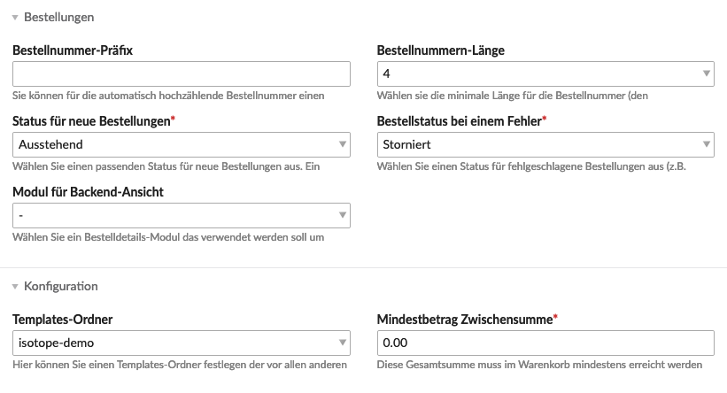

Hier hast du Bestellnummer, Platziert-Datum, Rechnungsadresse und Bestellstatus in einer Übersicht gelistet.

## Filter & Sortieren

Die Shop-Bestellungen kannst du hier nach verschiedenen Eigenschaften filtern. 

<table>
	<thead>
		<tr>
			<th>Filtername</th>
			<th>Bedeutung</th>
		</tr>
	</thead>
	<tbody>
		<tr>
			<td>Platziert</td>
			<td>Filtert die Bestellungen nach ihren Eingangsdatum in Monaten.</td>
		</tr>
		<tr>
			<td>Bestellstatus</td>
			<td>Filtert die Bestellungen nach ihren Status.</td>
		</tr>
		<tr>
			<td>Zahlungsart</td>
			<td>Filtert die Bestellungen nach der gewählten Zahlungsart.</td>
		</tr>
		<tr>
			<td>Versandart</td>
			<td>Filtert die Bestellungen nach der gewählten Versandart.</td>
		</tr>
	</tbody>
</table>

{}
Die Filter zeigen immer zur Auswahl an was schon in der Liste vorkommt, nicht alle Möglichkeiten welche es grundsätzlich gibt.
{}

Sortieren kannst du nach `Bestellnummer`, `Bestellstatus` und `Platziert`.

## Bearbeitungsmöglichkeiten der einzelnen Bestellungen

### 1. Bearbeiten

<table>
	<thead>
		<tr>
			<th>Einstellung</th>
			<th>Standardeinstellung</th>
			<th>Beschreibung</th>
		</tr>
	</thead>
	<tbody>
		<tr>
			<td>Bestellstatus</td>
			<td>Je nachdem welche Status vom System automatisch zugewiesen werden. Das kannst du einstellen in den Shop-Konfigurationen.</td>
			<td>Hier kannst du den Status der Bestellung manuell ändern.</td>
		</tr>
		<tr>
			<td>Bezahldatum</td>
			<td>-</td>
			<td>Hier kannst Du das Datum eintragen, sobald ein Kunde zum Beispiel Bar/Vorkasse gezahlt hat.</td>
		</tr>
		<tr>
			<td>Versanddatum</td>
			<td>-</td>
			<td>Hier kannst du das Datum des Versandes festhalten.</td>
		</tr>
		<tr>
			<td>Bestellanmerkungen</td>
			<td>-</td>
			<td>Bemerkungen für andere Benutzer im Backend.</td>
		</tr>
		
	</tbody>
</table>

### 2. Detailinformationen zu einzelnen Bestellungen

Neben dem Info-Button rechts sind drei weitere Buttons verfügbar.

- Über den **Zahlungsart-Button** () kannst du Informationen einsehen, welche mit dem Zahlungsvorgang einher gehen. Zum Beispiel steht hier wenn der Käufer mit Paypal gezahlt hat der Transaktionscode.
- Die gleich Art von Information bietet der **Versandart-Button** ([Versandart Icon](box-label.png)). Zum Beispiel könnte hier eine Trackingnummer zu sehen sein. Das hängt weitestgehend von den Versandanbietern ab, welche Informationen sie zurückgeben und ob sie der Entwickler der Versand- bzw. Zahlungsart implementiert hat.
- Mit dem **PDF-Button** () kannst du zum Beispiel eine Rechnung oder einen Lieferschein generieren. Die Vorlagen dafür kannst du dir selber anlegen und individuell anpassen.

## Sonstiges
### Neue Bestellungen werden auf der Startseite angezeigt.

### Bestellungen konfigurieren

Unter <docrobot_route name="general-settings">Shop-Konfigurationen</docrobot_route> können Konfigurationen zu den Bestellungen von dir vorgenommen werden. 

  
