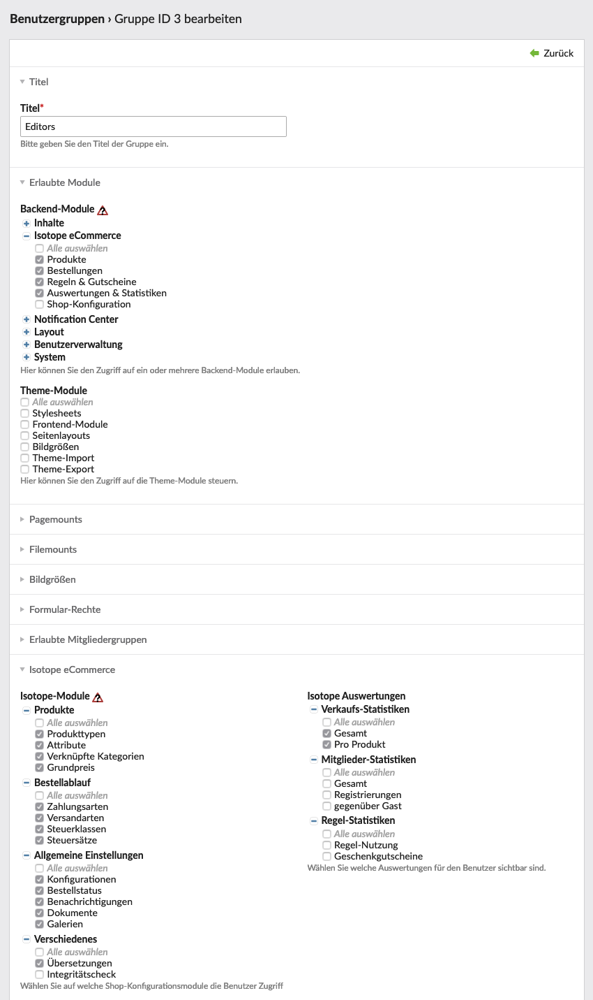

{}
This article is machine translated.
{}

In order to be able to manage the products sorted by category, the product administrator can create **product groups**. It makes sense to name them according to a certain system. For example, the groups can be named according to the product categories.

The different product folders can be nested within each other. Whenever a new product is created, a product is copied or moved, the product groups appear for selection. If there is no product in one of the product group folders yet, this **folder** will not be displayed in the normal product overview. The **products** can be managed clearly with the product groups.

- The groups are assigned as usual by icon () after they have been created.

## View

### 1. filter options groups and categories

In the upper area of the product overview you see the filter options. Large enough but not immediately obvious is the button "**Groups**" and next to it on the right the button "**Pages**". If you click the buttons a popup with a radio button selection opens. Here you can choose how you want to filter the products. You can delete the filter afterwards by selecting "Clear selection".

In the extended filter area there are further filter options, which refer to pictures, categories and setting time.

### 2. sort

Here you can sort your products by name, article number or alias.

- Under Sort you will also find a page structure icon ().

With this you can select a category page. After you have done this you can **sort the products manually**.

## Editing options

### 1. general

The edit button "**Product groups" is** self-explanatory. With "**Import attachments"** you can upload product images in advance to facilitate the product entry.

Isotope stores the product images independently of the file management for performance reasons in the folder root/isotope.

The names of the images must contain the article number or the corresponding product name. Isotope will match this. Programmers can also customize this matching.

### 2. single product

The editing options here are **View variants**, **Assign similar** products and Assign **group** in addition to the Contao core known **variants**.

### 3. product variants

You can have the variants **generated automatically** or create them individually.

#### Overview of the editing options for a product

##### Mandatory attributes, cannot be hidden

<table><thead><tr><th>Setting</th> <th>Standard setting</th> <th>Description</th> </tr></thead><tbody><tr><td>Product type</td> <td>Product type declared as default</td> <td>Product types are defined in the Product Type Manager</td> </tr><tr><td>Categories</td> <td>-</td> <td>Select a category for this product. Page-based categories take advantage of Contao page features like navigation automation, page protection, templates and full integration with content elements.</td> </tr><tr><td>Alias</td> <td>Generated based on the name</td> <td>Must be unique</td> </tr><tr><td>Name</td> <td>-</td> <td>Name of the product</td> </tr><tr><td>Images</td> <td>-</td> <td>Image selection by upload from PC</td> </tr><tr><td>Publish product</td> <td>0</td> <td>If checkbox is selected the product is published</td> </tr><tr><td>Start date</td> <td>-</td> <td>Here you can set a date for the day on which the product is to be published.</td> </tr><tr><td>Stop date</td> <td>-</td> <td>Here you can set a date for the day on which the product should be deactivated.</td> </tr><tr><td>Item number</td> <td>-</td> <td>Is not generated automatically. It must be configured in the product type whether the attribute is available here or in the product variants.</td></tr></tbody></table>

##### Standard attributes, can be shown and hidden

{}
 It must be configured in the product type whether the attribute is available here or in the product variants.   
 
{}

<table><thead><tr><th>Setting</th> <th>Default setting</th> <th>Description</th> </tr></thead><tbody><tr><td>Article number</td> <td>-</td> <td>Is not generated automatically. It must be configured in the product type whether the attribute is available here or in the product variants.</td> </tr><tr><td>Teaser</td> <td>-</td> <td>Short product description for the buyer. Will be displayed in the product list in the frontend.</td> </tr><tr><td>Description</td> <td>-</td> <td>Detailed product description for the buyer. Displayed in the product reader in the frontend.</td> </tr><tr><td>Meta Description</td> <td>-</td> <td>SEO (search engine optimization) description for the product.</td> </tr><tr><td>Meta keywords</td> <td>-</td> <td>SEO (search engine optimization) keywords for the product</td> </tr><tr><td>Meta title</td> <td>-</td> <td>SEO (search engine optimization) title for the product</td> </tr><tr><td>Protect product</td> <td>-</td> <td>If checkbox is enabled, specific member groups can be selected.</td> </tr><tr><td>Show only for guests</td> <td>-</td> <td>If checkbox is activated, the product will only be shown to guests.</td> </tr><tr><td>CSS ID/Class</td> <td>-</td> <td>An ID can be assigned to the product on the left and CSS classes on the right.</td> </tr><tr><td>Price</td> <td>-</td> <td>Price of the product</td> </tr><tr><td>Base price quantity</td> <td>-</td> <td>A base price for a given quantity.</td> </tr><tr><td>Shipping Weight</td> <td>-</td> <td>Plays a role in the shipping weight calculation.</td> </tr><tr><td>Exclude from shipping </td> <td>-</td> <td>Helpful for download items or products that will not be shipped.</td></tr></tbody></table>

##### Own attributes, can be shown and hidden

{}
 It must be configured in the product type whether the attribute is available here or in the product variants. 
{}

See also [Attributes](/de/backend-konfiguration-shop-Attribute/).

## Editor rights

### Release only certain product groups for an editor.

Under Sort you will also find a page structure icon .

More about Contao rights management: [Contao user manual - Users and groups](https://docs.contao.org/manual/en/user-management/users/#user-groups)
