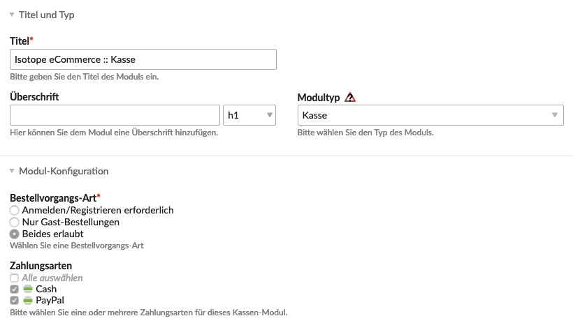
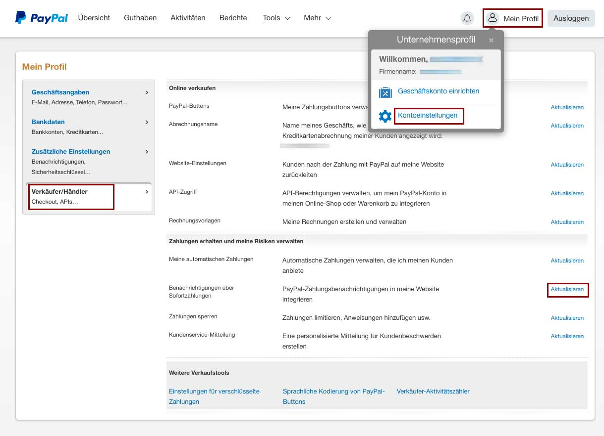
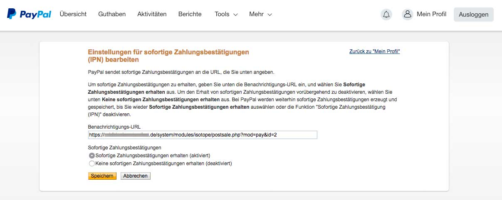

{}
Hier fehlt ein genereller Beschrieb.
{}

## Konfiguration des Zahlungsanbieters

<table>
	<thead>
		<tr>
			<th>Einstellung</th>
			<th>Standardeinstellung</th>
			<th>Beschreibung</th>
		</tr>
	</thead>
	<tbody>
		<tr>
			<td>PayPal-Konto</td>
			<td>-</td>
			<td>Deine mit deinem PayPal-Konto verknüpfte E-Mail-Adresse. Auf dieses PayPal-Konto wird der Betrag gutgeschrieben.</td>
		</tr>
	</tbody>
</table>

{}Die Zahlungsmethode PayPal muss auch noch im Modul "Kasse" aktiviert werden, was oft vergessen wird.{}

## Freigabe

<table>
	<thead>
		<tr>
			<th>Einstellung</th>
			<th>Standardeinstellung</th>
			<th>Beschreibung</th>
		</tr>
	</thead>
	<tbody>
		<tr>
			<td>Testsystem verwenden</td>
			<td>-</td>
			<td>Falls aktiviert, wird die Bezahlung nur in einer Testumgebung (Sandbox) emuliert aber tatsächlich nicht ausgeführt. Man kann sich bei Paypal hierzu auch einen <a href="https://developer.paypal.com/docs/classic/lifecycle/sb_create-accounts">Test-Account erstellen</a>.  Falls man in Firefox statt der Paypal Sandbox-Seite eine Sicherheitswarnung bekommt (SSL_ERROR_NO_CYPHER_OVERLAP) muss man in about:config die Einstellung security.tls.version.max zurück setzen.</td>
		</tr>
        <tr>
            <td>Aktiviere das Logging</td>
            <td>-</td>
            <td>Schreiben Sie Transaktionsinformationen in die Systemprotokolldateien.</td>
        </tr>
	</tbody>
</table>

## Konfiguration bei PayPal

### Generelle Beschreibung

Mit der Bezahlmethode "PayPal" wird der Dienst der PayPal (Europe) S.à r.l. et Cie, S.C.A. genutzt. Der Besteller wird extern zu PayPal weitergeleitet, schliesst dort die Bezahlung ab und ermächtigt PayPal damit zum Bankeinzug.

Um PayPal nutzen zu können wird vom Shopbetreiber ein PayPal-Konto vorausgesetzt. Hat der Besteller kein PayPal-Konto, steht ihm je nach getätigten Einstellungen im PayPal-Backend frei mit seinem Bankkonto oder Kreditkarte zu bezahlen.

[Weitere Informationen zu PayPal](https://www.paypal.com/de/)

### Hinweis für Beschreibung der Einstellung PayPal-Konto

Falls mit dem PayPal-Konto mehrere E-Mail-Adressen verknüpft sind, muss in Isotope eCommerce die Standard-Mailadresse hinterlegt werden.

### Konfiguration im PayPal-Backend

Bei Paypal müssen diverse Einstellungen vorgenommen werden, damit Isotope und PayPal richtig zusammenarbeiten.

### Art des PayPal-Kontos

Das PayPal-Konto muss ein Geschäftskonto sein, erst dann werden die benötigten Einstellungen freigeschaltet.

### Einstellungen für die IPN

Die Instant Payment Notification (IPN), zu deutsch "Sofortige Zahlungsbestätigung", informiert den Shopbetreiber per E-Mail über Zahlungseingänge auf dem PayPal-Konto. Im Screenshot ist zu sehen, unter welchem Menüpunkt man sie findet:

Neben der reinen Aktivierung muss auch die richtige Benachrichtigungs-URL eingegeben werden. Die URL ist der absolute Pfad zur postsale.php, der die ID des Bezahlmoduls "PayPal" angehängt wird.

{}

Hat das Modul die <strong>ID 1</strong> lautet die Benachrichtigungs-URL also z.B. <code>https://www.domain.de/system/modules/isotope/postsale.php?mod=pay&id=<strong>1</strong></code>

{}

{}

Bei Online-Shops wird generell die Verwendung eines SSL-Zertifikats empfohlen. PayPal setzt ab Juni 2016 verschlüsselte Verbindungen voraus, daher muss die Benachrichtigungs-URL auch https enthalten. Bitte stelle sicher, dass der Online Shop unter SSL läuft.

{}

#### Einstellungen der Sprachcodierung für IPN

In PayPal sollte die Sprachcodierung auf UTF-8 eingestellt sein, standardmässig ist sie auf `windows-1252` gestellt, was zu Fehlern, insbesondere bei Umlauten, führen kann. Zu finden ist die Einstellungen unter dem Begriff „Sprachliche Kodierung von PayPal-Buttons“, dort unter „Weitere Optionen“ `UTF-8` auswählen.

#### Hinweise zur gleichzeitigen Nutzung von Isotope, eBay und IPN

Betreibt man mit dem PayPal-Konto zusätzlich einen eBay-Shop (oder andere Systeme), versucht PayPal auch bei eBay-Bestellungen via IPN mit Isotope zu kommunizieren. Isotope meldet sich dann zwar mit einen 500 oder 424-Status-Code zurück, es tauchen aber vermehrt Fehler im System-Log auf und PayPal verschickt mehrmals Mails, dass die IPN-URL auf Fehler überprüft werden soll.

### Einstellungen für die Rückleitungs-URL

Wenn der Besteller nach erfolgreicher Zahlung wieder automatisch auf den Isotope-Shop zurückgeleitet werden soll, ist eine Einstellung in den "Website-Einstellungen" des PayPal-Backends zu setzen.

Die Rückleitungs-URL muss laut PayPal-Richtlinien diverse Informationen enthalten. Hier trägt man den absoluten Pfad auf diese Seite ein.

  

### Einstellungen in den Backend-Konfigurationen in der Zahlart  
#### Bei aktiviertem Testsystem  

Damit die Zahlungsabwicklung in der PayPal Sandbox im Testsystem funktioniert muss  
der Haken bei **Testsystem verwenden** gesetzt sein und  
unter **PayPal-Konto** die Business-E-Mail Adresse des erstellten Sandbox-Accounts eingetragen sein.  
  

{}  

Bevor der Shop live geschalten wird, muss der Haken wieder entfernt und die eigene E-Mail Adresse des Shops eingefügt werden.  

{}

