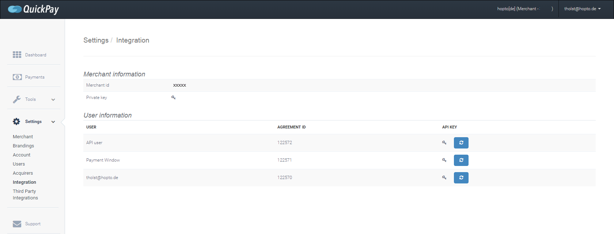
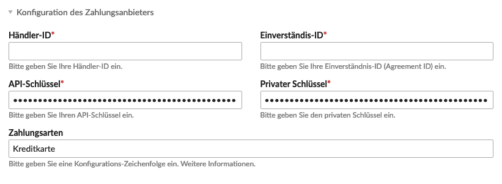

{}
This article is machine translated.
{}

QuickPay is a Danish payment provider that has been offering its services since 2004. More information can be found on [the company website](https://www.quickpay.net/).

The process requires a QuickPay account that provides you with the information to provide an appropriate payment window to your customers.

{}
You

also need an account with a payment company that handles the actual money transfer (actual debit/credit) for you. In the case of QuickPay, you can select the payment company within your QuickPay account and use it accordingly. Of course, you also need a separate contract with the payment company.

{}
 ## General settings

<table><thead><tr><th>Setting</th> <th>Default setting</th> <th>Description</th> </tr></thead><tbody><tr><td>Transaction Type</td> <td>Authorize and collect</td> <td>Here you can specify the transaction type. - **Authorize and collect** Transactions of this type are sent for authorization. The transaction is automatically routed for settlement if the transaction is successful.
- **Authorize Only** Transactions of this type are sent when the merchant wants to have the credit card checked for the quantity of goods sold. If the merchant does not have enough goods in stock or wants to check the orders before the goods are delivered, this transaction type will be transferred.
 
</td></tr></tbody></table>

## Configuration of the payment provider

<table><thead><tr><th>Setting</th> <th>Default setting</th> <th>Description</th> </tr></thead><tbody><tr><td>Merchant ID</td> <td>-</td> <td>Corresponds to the Merchant ID in QuickPay.</td> </tr><tr><td>Consent ID</td> <td>-</td> <td>Corresponds in QuickPay to the Payment Window - Agreement ID.</td> </tr><tr><td>API Key</td> <td>-</td> <td>Corresponds in QuickPay to the Payment Window - API KEY Key</td> </tr><tr><td>Private Key</td> <td>-</td> <td>Corresponds in QuickPay to Merchant information - Private Key.</td> </tr><tr><td>Payment types</td> <td>creditcard</td> <td>Here you can define the payment methods agreed upon with the payment company. [Further Information](https://learn.quickpay.net/tech-talk/appendixes/payment-methods/)</td></tr></tbody></table>

## Release

<table><thead><tr><th>Setting</th> <th>Default setting</th> <th>Description</th> </tr></thead><tbody><tr><td>Enable logging</td> <td>-</td> <td>Write transaction information to the system log files.</td></tr></tbody></table>

Here is a pictorial help of the field mapping:

QuickPay:

And the corresponding mapping in Isotopes:

