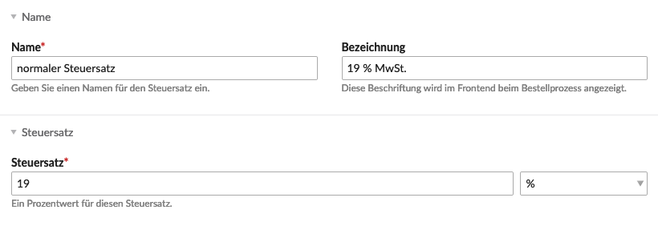
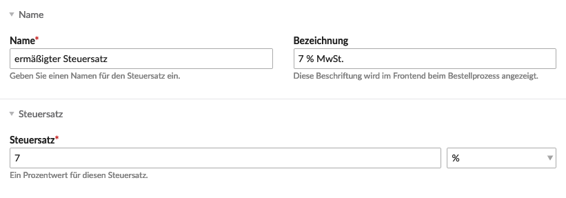

{}
This article is machine translated.
{}

For a shop configuration, at least one tax rate must exist.

Click on "New tax rate" and simply fill in the mandatory fields **"Tax rate** name **", "Tax rate**" and "Address base for calculation". **Address base for calculation** sounds strange at first. Tax rates can vary from country to country or state to state. Therefore select here if the billing or shipping address should be preferred as reference, or if both addresses should be included.

{}
 This feature is new in Isotope eCommerce 2.3. Now you can check the VAT number, if it is valid you can prevent the tax from being applied by selecting the appropriate option in the tax rate. 
{}

## Name

<table><thead><tr><th>Setting</th><th>Default setting</th><th>Description</th></tr></thead><tbody><tr><td>Name</td><td>-</td><td>Here you can enter the tax rate name.</td></tr><tr><td>Name</td><td>-</td><td>The description will be displayed instead of the tax rate name in the frontend during the order process.</td></tr><tr><td>Tax rate</td><td>-</td><td>Here you can set the percentage value for the tax rate.</td></tr></tbody></table>

## Location

<table><thead><tr><th>Setting</th><th>Default setting</th><th>Description</th></tr></thead><tbody><tr><td>Address base for the calculation</td><td>Shipping address</td><td>Select based on which address this tax rate should be calculated. The shipping address for non-shippable products.</td></tr><tr><td>Countries</td><td>-</td><td>Select the countries to which this tax rate applies.</td></tr><tr><td>Countries/States/Regions</td><td>-</td><td>Select the countries to which this tax class applies.</td></tr><tr><td>Postal codes</td><td>-</td><td>Limits the tax rate to zip codes. You can select a range with comma separated list (e.g. 1234,1235,1236-1239,1100-1200).</td></tr></tbody></table>

## Conditions

<table><thead><tr><th>Setting</th><th>Default setting</th><th>Description</th></tr></thead><tbody><tr><td>Subtotal value constraint</td><td>-</td><td>Limit this tax rate to a specific subtotal value (for example, for a luxury tax).</td></tr></tbody></table>

## Configuration

<table><thead><tr><th>Setting</th><th>Default Setting</th><th>Description</th></tr></thead><tbody><tr><td>Shop Configuration</td><td>-</td><td>Select for which shop configuration this tax rate is valid.</td></tr><tr><td>Exempt VAT number if valid.</td><td>-</td><td>Do not apply the tax if the VAT number is valid.</td></tr><tr><td>Stop calculation on trigger</td><td>-</td><td>Stop other calculations when this tax rate is triggered.</td></tr><tr><td>Use only for guests</td><td>-</td><td>Do not use this tax rate for logged in members (unless the appropriate groups are allowed).</td></tr><tr><td>Protect tax rate</td><td>-</td><td>Assign this tax rate to specific member groups only.</td></tr></tbody></table>

## Example:

There are two tax rates that can be used for sales in Germany, the normal tax rate and the reduced tax rate (for e.g. food, books, magazines).

