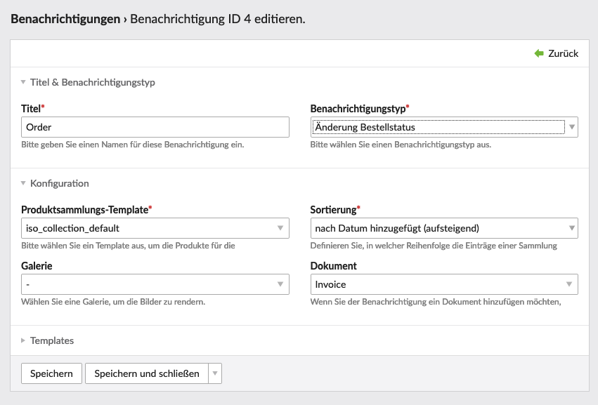

{}
This article is machine translated.
{}

## Notifications

A `Benachrichtigung` is a collection of individual [messages]((/de/backend-konfiguration-shop-allgemein-benachrichtigszentrum-nachrichten/)). It is also always of a specific type. In Isotope eCommerce, there is currently only one type of notification, called `Änderung Bestellstatus`.

{}
You may wonder why there is no `Bestellbestätigung` type. The reason is simple: it corresponds to a status change from `gar nichts` to `neu` and is therefore also just a `Änderung (des) Bestellstatus`.
{}

### Title &amp; Type

<table><thead><tr><th>Setting</th> <th>Default setting</th> <th>Description</th> </tr></thead><tbody><tr><td>Title</td> <td>-</td> <td>Here you can enter a title for your notification. It will only be used for the backend.</td> </tr><tr><td>Type</td> <td>-</td> <td>Each notification is of a certain type. Any extension can provide any type. You also define later which <docrobot_route name="simple-tokens">Simple Tokens</docrobot_route> can be used.</td></tr></tbody></table>

### Configuration for the type "Change order status

<table><thead><tr><th>Setting</th> <th>Default setting</th> <th>Description</th> </tr></thead><tbody><tr><td>Product collection template</td> <td>iso\_collection\_default</td> <td>Here you can select a product collection template to change the appearance of the products in your messages.</td> </tr><tr><td>Sorting</td> <td>added by date (ascending)</td> <td>This selection allows you to determine the order in which the products are listed in the message.</td> </tr><tr><td>Gallery</td> <td>-</td> <td>Here you can select the gallery that will be used to process the product images in the message. If you don't select anything here, the template of the respective product type will be chosen (recommended).</td> </tr><tr><td>Document</td> <td>-</td> <td>This setting refers to a <docrobot_route name="documents">document</docrobot_route> that can later be attached to the message via <docrobot_route name="simple-tokens">Simple Token</docrobot_route>.</td></tr></tbody></table>
