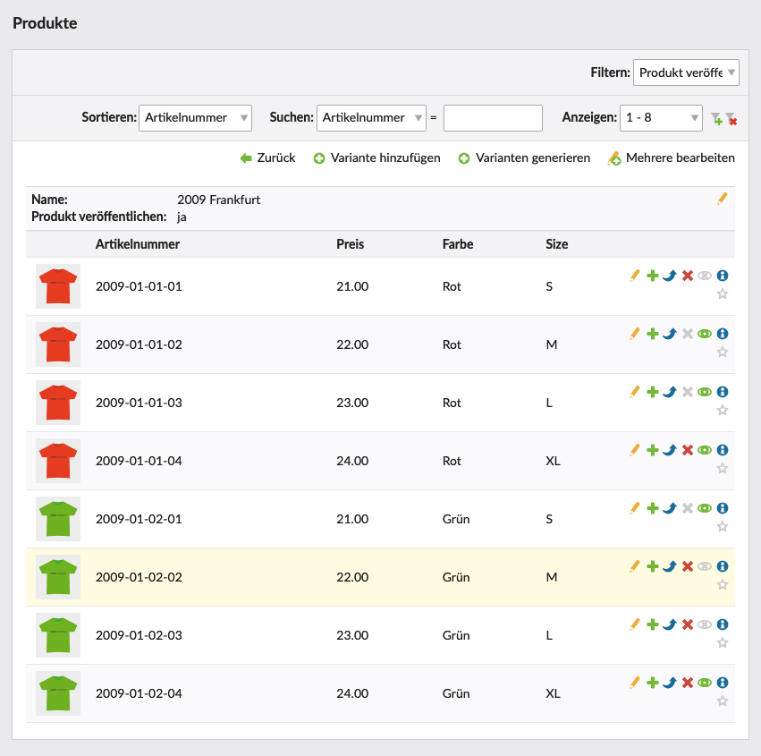

{}
This article is machine translated.
{}

You must create at least one product type.

## Product type settings

<table><thead><tr><th>Setting</th> <th>Default setting</th> <th>Description</th> </tr></thead><tbody><tr><td>Name</td> <td>-</td> <td>Choose a descriptive name for this product type, so that you can keep track of several.</td> </tr><tr><td>Product class</td> <td>Standard Product</td> <td>Third party extensions allow developers to implement special functions for products. The standard functions of Isotope eCommerce are covered by `Standard Produkt`.</td> </tr><tr><td>Standard</td> <td>-</td> <td>If this field is activated, this product type is automatically preselected when creating a new product.</td></tr></tbody></table>

## Description

<table><thead><tr><th>Setting</th> <th>Default</th> <th>Description</th> </tr></thead><tbody><tr><td>Description</td> <td>-</td> <td>Here you can enter notes about the product type. These notes will be displayed in the Helpwizard  when you create a new product.</td></tr></tbody></table>

## Prices

<table><thead><tr><th>Setting</th> <th>Default setting</th> <th>Description</th> </tr></thead><tbody><tr><td>Extended prices</td> <td>-</td> <td>By checking this box, you can assign multiple prices to a product, for different shop configurations or member groups, or set up tiered pricing.</td> </tr><tr><td>Show Price Levels</td> <td>-</td> <td>If this field is activated, the lowest price of the highest level is displayed in the frontend. If you have created a <docrobot_route name="product-management">product</docrobot_route> with the following price scale: - 1 = 9.00
- 3 = 8.00
- 6 = 7.00
 
 The output in the frontend looks like this: From EUR 7.00.</td></tr></tbody></table>

<table><thead><tr><th>Setting</th> <th>Default setting</th> <th>Description</th> </tr></thead><tbody><tr><td>Listing template</td> <td>iso\_list\_default</td> <td>Here you can select the template for the <docrobot_route name="product-list">product list</docrobot_route>.</td> </tr><tr><td>Reader template</td> <td>iso\_reader\_default</td> <td>Here you can select the template for the <docrobot_route name="product-reader">product reader</docrobot_route>.</td> </tr><tr><td>List gallery</td> <td>-</td> <td>Here you can select a <docrobot_route name="galleries">gallery</docrobot_route> for the product list.</td> </tr><tr><td>Gallery for detail page</td> <td>-</td> <td>Here you can select a <docrobot_route name="galleries">gallery</docrobot_route> for the product reader.</td> </tr><tr><td>CSS class</td> <td>-</td> <td>The class(es) will be added to the product list and product reader.</td></tr></tbody></table>

## Product attributes

Setting the product attributes determines how the input mask for this product type should look like. Attributes that are often used or required by the system are already predefined.

<table><thead><tr><th>Setting</th> <th>Default setting</th> <th>Description</th> </tr></thead><tbody><tr><td>Name</td> <td>-</td> <td>The name in the square brackets to the right of the attribute name is the name of the associated database field.</td> </tr><tr><td>Grouping</td> <td>-</td> <td>In Contao, groups of form fields can be defined and expanded or collapsed. Isotope eCommerce offers the following groups for products: - General settings
- Meta information
- Price settings
- Inventory settings
- Shipping settings
- Product Option Settings
- File Management
- Expert Settings
- Publishing

</td> </tr><tr><td>Alignment</td> <td>-</td> <td>For an overview of the available classes, see the <docrobot_route name="product-types" path="#ausrichtung">Alignment table</docrobot_route>.</td> </tr><tr><td>Mandatory</td> <td>-</td> <td>Here you can make the field mandatory.</td></tr></tbody></table>

### Alignment

The Contao backend uses a 2-column grid system to align form fields within their groups.

<table id="ausrichtung"><thead><tr><th>tl\_class</th> <th>Description</th> </tr></thead><tbody><tr><td>w50</td> <td>Sets the field width to 50% and floats the element ( `float:left`).</td> </tr><tr><td>clr</td> <td>Cancels all floats ( `clear:both`).</td> </tr><tr><td>wizard</td> <td>Shortens the input field so that there is enough space for the wizard (e.g. date picker).</td> </tr><tr><td>long</td> <td>Makes the input field span two columns.</td> </tr><tr><td>m12</td> <td>Adds a top spacing of 12 pixels to the element (e.g. for single checkboxes).</td></tr></tbody></table>

## Variant attributes

With variant, additional selection options can be added to a product, e.g. colors, sizes, etc.

<table><thead><tr><th>Setting</th> <th>Default setting</th> <th>Description</th> </tr></thead><tbody><tr><td>Activate variants</td> <td>-</td> <td>Enable variants for this product type.</td> </tr><tr><td>Name</td> <td>-</td> <td>The name in the square brackets to the right of the attribute name is the name of the associated database field.</td> </tr><tr><td>Grouping</td> <td>-</td> <td>In Contao, groups of form fields can be defined and expanded and collapsed. Isotope eCommerce offers the following groups for products: - General settings
- Meta information
- Price settings
- Inventory settings
- Shipping settings
- Product Option Settings
- File Management
- Expert Settings
- Publishing

</td> </tr><tr><td>Alignment</td> <td>-</td> <td>For an overview of the available classes, see the <docrobot_route name="product-types" path="#ausrichtung">Alignment table</docrobot_route>.</td> </tr><tr><td>Mandatory</td> <td>-</td> <td>Here you can make the field mandatory.</td> </tr><tr><td>Always display variants of an attribute</td> <td>-</td> <td>If you want to display variants of an attribute (select menu, radio menu) even if only one is available, you have to activate this field.</td></tr></tbody></table>

## Expert settings

<table><thead><tr><th>Setting</th> <th>Default setting</th> <th>Description</th> </tr></thead><tbody><tr><td>Exclude from shipping</td> <td>-</td> <td>If you want to exclude a product from shipping, you have to activate this field (e.g. download products).</td> </tr><tr><td>Enable downloads</td> <td>-</td> <td>If the product type is a product that should be downloaded, you have to activate this field.</td></tr></tbody></table>
