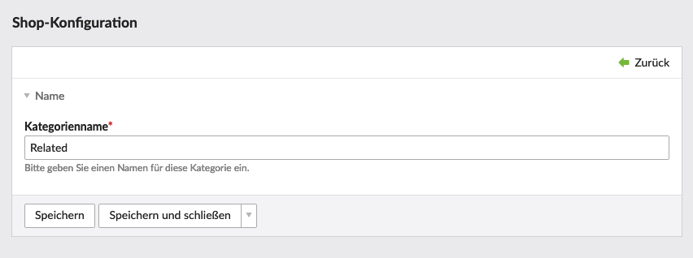
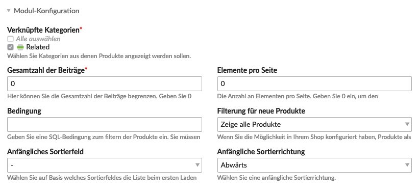

{}
This article is machine translated.
{}

`Verknüpfte Kategorien` is used exclusively in connection with the[Similar Products](/de/frontend-konfiguration-module-%C3%84hnliche-Produkte/) module.

It forms the basis for the function known from many webshops for things like.

- "Customers who bought this product also bought".
- Accessories for this product
- etc.

However, a `verknüpfte Kategorie` is not always the same for every product. Let's take the "accessories" function as an example. For product A, the accessories are products X and Y, but for product B, they are products K and L.

Therefore, the mapping for the categories is done in the product itself. Once you have created at **least one** `verknüpfte Kategorie`, you can do the linking in the [products](/de/backend-produkte/)themselves.

## Procedure for setting up similar products

1. Isotope eCommerce &gt; Shop Configuration &gt; Create linked categories  
  `Neue Kategorie` with the name `Related`.  
  
2. Isotope eCommerce &gt; [Products](/de/backend-produkte/)First you need to find out IDs of similar products, for that hover over blue icon (). Then go to `Kategorie hinzufügen`, select the category `Related` and add the product IDs under `Produkte`.  
  
3. Modules &gt; Create [Similar Products](/de/frontend-konfiguration-module-%C3%84hnliche-Produkte/)Module and select `Related` under Module Configuration.  
  
4. Content &gt; Article  
  Now place the created module in the article with [product list](/de/frontend-konfiguration-module-produktliste/)and [product reader](/de/frontend-konfiguration-module-Produktleser/).  
  
