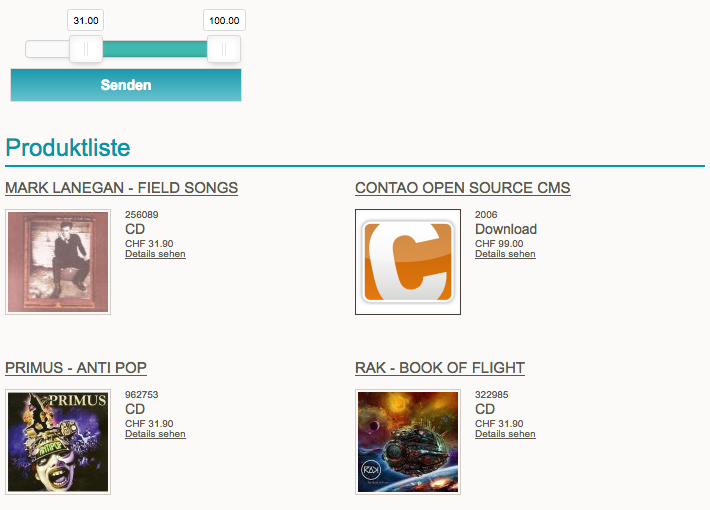

{}
This article is machine translated.
{}



The `Bereichsfilter` generates a navigation from the selected filter attributes, with which a product list can be restricted.

## Example

As an example we use a product list, where we can influence the display by dragging the range filter.

The filter configuration in the module:

The output in the frontend:

## Module configuration

<table><thead><tr><th>Setting</th> <th>Default setting</th> <th>Description</th> </tr></thead><tbody><tr><td>Category Application Area</td> <td>Active category</td> <td>Each individual option is described in the Contao internal helpwizard ().</td> </tr><tr><td>Condition</td> <td>-</td> <td>Here you can enter your own SQL conditions, which will be attached to the corresponding query and executed.</td> </tr><tr><td>Filtering for new products</td> <td>Show all products</td> <td>If you have configured the possibility to mark products as "new" in your shop, you can filter either for old, new or for all products. Options: - Show all products Show
- only new
products Show - old

products </td> </tr><tr><td>Filter configuration</td> <td>-</td> <td>Here you can configure the fields of the restrictive filter. <table><tbody><tr><td>Attributes</td> <td>A selection of <docrobot_route name="attributes">attributes</docrobot_route> created in the shop configuration.</td> </tr><tr><td>Range from</td> <td>-</td> </tr><tr><td>Range to</td> <td>-</td> </tr><tr><td>Steps</td> <td>-</td> </tr></tbody></table>

</td> </tr><tr><td>Hide individual selections</td> <td>-</td> <td>Here you can hide fields for the filter if there is only one selection.</td></tr></tbody></table>

## Template settings

<table><thead><tr><th>Setting</th> <th>Default setting</th> <th>Description</th> </tr></thead><tbody><tr><td>Individual template</td> <td>-</td> <td>Here you can overwrite the default template.</td> </tr><tr><td>Navigation template</td> <td>nav\_default</td> <td>Here you can select a template for the filter and change the output. As explained in the example, this filter generates a navigation, so all navigation templates are available for selection here.</td> </tr><tr><td>Include messages</td> <td>-</td> <td>If this option is enabled, the errors and notices will be output directly in the module and not as a JavaScript overlay.</td> </tr><tr><td>Hide for product view</td> <td>-</td> <td> This option hides the product filter if a product alias is found in the URL.</td></tr></tbody></table>

## Redirect

<table>
    <thead>
    <tr>
        <th>Setting</th>
        <th>Default setting</th>
        <th>Description</th>
    </tr>
    </thead>
    <tbody>
    <tr>
        <td>Forwarding Page</td>
        <td>-</td>
        <td>If you select a page here, the visitor will be redirected to that page when submitting the filter.
        {}
Since the filter settings are cached, the placement of the filter is irrelevant. However, this changes as soon as you activate search fields. Search queries are not cached and it is therefore necessary to include the product filter <strong>before the product list on the same page</strong>!
{}
        </td>
    </tr>
    </tbody>
</table>

## Reference page

<table>
    <thead>
    <tr>
        <th>Setting</th>
        <th>Default setting</th>
        <th>Description</th>
    </tr>
    </thead>
    <tbody>
    <tr>
        <td>Set a reference page</td>
        <td>-</td>
        <td> If you specify a reference page, the "Category Application Area" in the module configuration will refer to the selected reference page rather than the current page. An example could be a page "Highlights" to which certain products are assigned. If you now want to display these on the start page, you select the "Active category" for the "Category application area" and select the "Highlights" page for the reference page.</td>
    </tr>
    </tbody>
</table>
