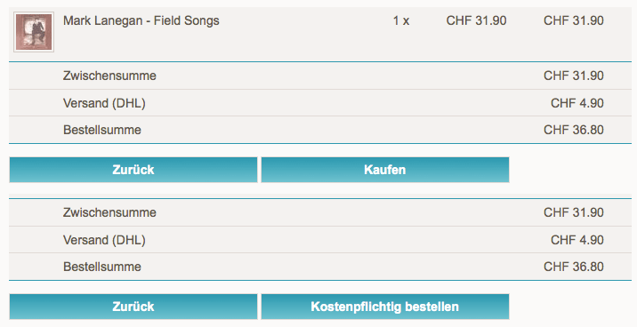

## Mindestbestellmenge einrichten

Die Mindestbestellmenge wird wie folgt eingerichtet:

Im <docrobot_route name="product-types">Produktyp</docrobot_route> unter <strong>Preise</strong> bitte <strong>Erweiterte Preisangaben</strong> aktivieren.

Danach im <docrobot_route name="product-management">Produkt</docrobot_route> unter <strong>Preis-Einstellungen</strong> die Menge bei der Preisstaffelungen anpassen.


## Isotope-Textausgabe im Frontend anpassen

Du möchtest die Ausgabe eines von Isotope vorgegebenen Textes im Frontend anpassen.

Gebe auf GitHub das zu ändernde Wort in das Suchfeld ein.


Kopiere die Code-Zeile in deine `system/config/langconfig.php` und ersetze "Kaufen" durch "Kostenpflichtig bestellen".

``` php
$GLOBALS['TL_LANG']['MSC']['confirmOrder'] = 'Kostenpflichtig bestellen';
```

Bei einer mehrsprachigen Seite muss der Code wie folgt aussehen:

``` php
if ($GLOBALS['TL_LANGUAGE'] == 'de')
{
    $GLOBALS['TL_LANG']['MSC']['confirmOrder'] = 'Kostenpflichtig bestellen';
}
elseif ($GLOBALS['TL_LANGUAGE'] == 'en')
{
   $GLOBALS['TL_LANG']['MSC']['confirmOrder'] = 'Order';
}
```




## Bestellungen mit zusätzlichem Attribut im Backend ausgeben

Lege ein Attribut mit folgenden Eigenschaften an:

<table>
    <thead>
        <tr>
            <th>Einstellung</th>
            <th>Wert</th>
        </tr>
    </thead>
    <tbody>
        <tr>
            <td>Name</td>
            <td>Lieferbar</td>
        </tr>
        <tr>
            <td>Interner Name</td>
            <td>lieferbar</td>
        </tr>
        <tr>
            <td>Typ</td>
            <td>Radio-Button-Menü</td>
        </tr>
        <tr>
            <td>Options Wizard</td>
            <td>
                <table>
                    <thead>
                        <tr>
                            <th>Wert</th>
                            <th>Bezeichnung</th>
                        </tr>
                    </thead>
                    <tbody>
                        <tr>
                            <td>Ja</td>
                            <td>Ja</td>
                        </tr>
                        <tr>
                            <td>Nein</td>
                            <td>Nein</td>
                        </tr>
                    </tbody>
                </table>
            </td>
        </tr>
     </tbody>
</table>

Danach das Attribut im Produkttyp aktivieren.

Folgenden Code in deine `system/config/dcaconfig.php` kopieren.

``` php
if(is_array($GLOBALS['TL_DCA']['tl_iso_product']['list']['label']['fields']))
{
    if(!in_array('lieferbar',$GLOBALS['TL_DCA']['tl_iso_product']['list']['label']['fields']))
        $GLOBALS['TL_DCA']['tl_iso_product']['list']['label']['fields'][] = 'lieferbar'; 
} 
```

Das Resultat


Herzlichen Dank an <a href="https://community.contao.org/de/member.php?9203-Spooky" target="_blank">Spooky</a>.


## Bestellungen mit Uhrzeit im Backend ausgeben

Folgenden Code in deine `system/config/dcaconfig.php` kopieren.

``` php
$GLOBALS['TL_DCA']['tl_iso_product_collection']['fields']['locked']['eval']['rgxp'] = 'datim';
```

Vorher


Nachher


## Staffelpreis-Tabelle in der Produktansicht ausgeben

Folgenden Code an der gewünschten Stelle in die `iso_reader_default.html5` kopieren.

``` php
<?php echo $this->generateAttribute('price_tiers'); ?>
```


## Testbestellungen können nicht gelöscht werden?

Dafür gibt es bewusst keinen Knopf im Backend, da tatsächliche Bestellungen nie gelöscht werden sollen.
Diese werden dann aufgrund der Nachverfolgbarkeit lediglich als storniert markiert werden.
Um Testbestellungen vor dem Launch zu löschen, leere (SQL-Query `TRUNCATE`) alle Tabellen in der Datenbank,
die mit `tl_iso_product_collection` beginnen.
